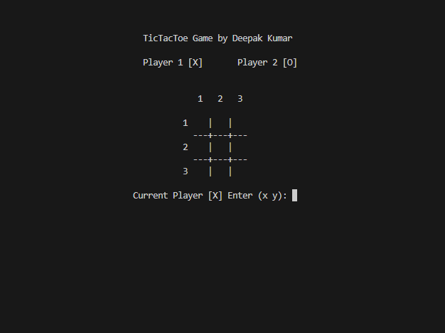

# TicTacToe Game

## Introduction

This is a simple TicTacToe game implemented in C. It allows two players to take turns placing their marks (X or O) on a 3x3 grid, aiming to get three marks in a row, column, or diagonal.

## Features

- Two-player game: Player 1 is represented by 'X' and Player 2 by 'O'.
- Checks for win conditions and declares the winner or a draw.
- Option to continue playing or exit after a game ends.

## Screenshots

